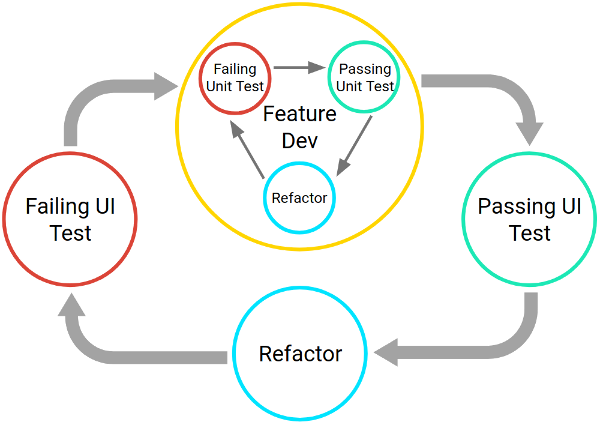

# Unit Testing
* 一个应用的最小可测试部分
* 在面向对象中，可以是接口、类或独立的方法。
* 在维基百科中，单元测试被定义为一段代码调用另一段代码，随后检验一些假设的正确性。

# 为什么要做单元测试？
* 对故障的快速反馈。
* 在开发中更早的故障检测。
* 更安全的代码重构，优化代码的时候不必担心代码回归的问题。
* 更稳定的发展速度，帮助减少技术债务。

# 如何做单元测试？
## 工作流


* 当我们开发一个功能的时候，会先写单元测试（可能是在原来的基础上添加，也可能是新创建的），这时候单元测试是失败的，因为功能还没有开发。
* 开发功能过程中，会思考如何测试，功能和测试互相影响，直到整个流程可以跑通。

## 金字塔


测试包含单元测试、集成测试和 UI 测试，三部分，推荐的占比为 70%、20% 和 10% 。

单元测试可以在电脑或 jenkins 上运行，不需要依赖具体的设备，运行快成本低。

集成测试和 UI 测试，需要依赖设备运行，运行时间和成本都比较高。


# 可供单元测试的框架
* JUnit
* Mockito
* Robolectric

## [JUnit](https://github.com/junit-team/junit4)


JUnit 是一个 jave 测试框架。目前最新版本是 junit5，但是目前 AndroidStudio 还不支持 Junit5，所以这里介绍的是 Junit4。

AndroidStudio 创建一个工程默认就会依赖 Junit4
```html
testImplementation 'junit:junit:4.12'
```

下面是一个测试过程：


上面的图可以看到两个信息：
* Annotation 注解
* Assert 断言

### Annotation 注解
* @Test 表示是一个测试方法
* @BeforeClass 测试类初始化时执行一次
* @AfterClass 测试类销毁时执行一次
* @Before 每一个测试方法执行之前执行
* @After 每一个测试方法执行之后执行
* @Rule 添加规则
* @Ignore 忽略测试方法

其中 @Test 还可以添加 expected、timeout 参数，比如：
```java
/**
 * 期望得到的异常
 */
@Test(expected = NullPointerException.class)
@Ignore
public void expectedTest() {
    println("expected");
    throw new NullPointerException("");
}
/**
 * 超时处理
 */
@Test(timeout = 500)
@Ignore
public void timeoutTest() {
    println("timeout");
    try {
        Thread.sleep(200);
    } catch (InterruptedException e) {
        e.printStackTrace();
    }
}
```

一个完整的例子：
```java
public class AnnotationTest {

    /**
     * 类初始化执行，静态
     */
    @BeforeClass
    public static void beforeClassTest() {
        println("》》》》》BeforeClass《《《《《");
    }

    /**
     * 类销毁执行，静态
     */
    @AfterClass
    public static void afterClassTest() {
        println("》》》》》AfterClass《《《《《");
    }

    /**
     * 每个测试方法之前执行
     */
    @Before
    public void beforeTest() {
        println("* * * Before * * *");
    }

    /**
     * 每个测试方法之后执行
     */
    @After
    public void afterTest() {
        println("* * * After * * *");
    }
    /**
     * 测试类
     */
    @Test
    public void test() {
        println("Test");
    }
    
    @Test
    public void test1() {
        println("Test1");
    }
}
```
执行结果：
```html
》》》》》BeforeClass《《《《《
* * * Before * * *
Test
* * * After * * *
* * * Before * * *
Test1
* * * After * * *
》》》》》AfterClass《《《《《
```

### Assert 断言
对于断言，我们可以看这个类：org.junit.Assert

Assert 提供的方法：
* assertTrue(boolean) 断言为 true
* assertFalse(boolean) 断言为 false
* fail(String) 断言失败，常用于判断方法的执行
* assertEquals() 断言相等
* assertNotEquals() 断言不相等
* assertArrayEquals() 断言数组相等
* assertNotNull() 断言不为空
* assertNull() 断言为空
* assertSame() 断言对象地址相同
* assertNotSame() 断言对象地址不相同
* assertThat(T, Matcher) 断言 T 符合 Matcher

这里重点介绍一下 assertThat
对于 Matcher 我们可以看：org.hamcrest.CoreMatchers

CoreMatchers 类提供的方法：
* allOf 所有条件都符合
* anyOf 符合任意一个条件即可
* both 两个条件都必须符合
* either 符合其中一个条件即可
* describedAs 添加描述信息，错误后会打印
* everyItem 每一条都满足
* is(T) 是不是地址相同
* is(Matcher) 是否符合 Matcher
* isA(Class<T>) 是不是属于某个类
* anything 总是返回 true
* hasItem 列表中是否包含
* equalTo 引用是否相等
* any 是不是某个类
* instanceOf 是否是某种类型
* not 不是某个对象或不符合某个 Matcher
* nullValue 非空
* notNullValue 空
* sameInstance 引用同一对象
* theInstance 引用同一对象
* containsString 包含某个字符串
* startsWith 以什么开头
* endsWith 以什么结尾

下面是一个例子：
```java
    @Test
    public void assertThatTest() {
        assertThat(1, is(1));

        assertThat(1, is(equalTo(1)));

        assertThat(1, allOf(is(1), not(0)));

        assertThat(1, anyOf(is(0), not(2)));

        assertThat(1, both(is(1)).and(not(2)));

        assertThat(1, either(is(1)).or(not(1)));

        assertThat(1, describedAs("describeAs error", is(1), "abc"));

        assertThat(Arrays.asList("bar", "baz"), everyItem(startsWith("ba")));

        assertThat(new A(), isA(A.class));

        assertThat(1, equalTo(1));

        assertThat(new A(), any(A.class));

        assertThat(new A(), instanceOf(A.class));

        assertThat(1, not(0));

        assertThat(null, nullValue());

        assertThat(new A(), notNullValue());

        A a = new A();
        A b = a;
        assertThat(a, isA(A.class));

        assertThat(a, anything());

        assertThat(a, any(A.class));

        assertThat(a, not(new A()));

        assertThat(a, not(is(new A())));

        assertThat(a, sameInstance(b));

        assertThat(a, theInstance(b));

        assertThat("abc", containsString("a"));

        assertThat("abc", startsWith("a"));

        assertThat("abc", endsWith("c"));
    }
```

## [Mockito](http://mockito.org)


Mockito 可以 mock 创建一个对象，验证方法的执行和 mock 方法的返回值。

### 添加依赖：
```java
testImplementation "org.mockito:mockito-core:2.23.4"
androidTestImplementation "org.mockito:mockito-android:2.23.4"
```
对于 Mockito，重点包含下面四个方面：
* Mock
* Spy
* Mock Result
* Verify

### Mock
Mock 一个对象有三种方法。

方法一：

@Mock 注解 + MockitoAnnotations.initMocks 方法
```java
public class MockInitTest {
    @Mock
    ModelImpl model;

    @Before
    public void setUp() {
        MockitoAnnotations.initMocks(this);
    }

    @Test
    public void testMock() {
        assertNotNull(model);
    }
}
```

方法二：

@RunWith(MockitoJunitRunner.class)
```java
@RunWith(MockitoJUnitRunner.class)
public class MockJunitRunnerTest {
    @Mock
    ModelImpl model;

    @Test
    public void testMock() {
        assertNotNull(model);
    }
}
```

方法三：

@Rule public MockitoRule rule = MockitoJUnit.rule();

```java
public class MockRuleTest {
    @Mock
    ModelImpl model;

    @Rule
    public MockitoRule rule = MockitoJUnit.rule();

    @Test
    public void testMock() {
        assertNotNull(model);
    }
}
```
注意点：

@Mock 得到的对象，所有方法的返回值都是默认值，即 boolean 返回 false，int 返回 0 等。

@Mock 得到的对象，调用它的方法不会做任何处理，相当于方法没有被执行。

### Spy

@Spy 和 @Mock 的初始化类似，只需要将 @Mock 改成 @Spy

注意点：

@Spy 得到的对象，所有方法的返回值和 new 一个对象的调用相同。

@Spy 的好处是可以 mock result

### Mock Result
Mockito 可以 Mock 方法的返回值，提供的方法：

doxxx().when()
* doThrow(Throwable...) 调用某个方法时抛出异常
* doCallRealMethod() 调用真实的方法
* doAnswer(Answer) 通过 Answer 处理方法调用结果
* doNothing() 调用方法时，什么都不执行
* doReturn() 调用方法时返回某个值

when().then()
* when().thenThrow() 当调用某个方法时抛出异常
* when().thenCallRealMethod() 调用真实的方法
* when().thenAnswer(Answer) 通过 Answer 处理调用结果
* when().then(Answer) 通过 Answer 处理调用结果
* when().thenReturn() 调用方法时返回某个值

then().should()
* then().should(VerificationMode) 验证应该怎样
* then().shouldHaveNoMoreInteractions() 验证没有执行过
* then().shouldHaveZeroInteractions() 验证没有执行过

given().willxxx()
* given().willThrow() 抛异常
* given().willAnswer(Answer) 通过 Answer 处理调用结果
* given().will(Answer) 通过 Answer 处理调用结果
* given().willDoNothing() 什么都不做
* given().willReturn() 返回某个值
* given().willCallRealMethod() 调用真实的方法

举个例子：
```java
public class MockResultTest {

    @Mock
    ModelImpl model;

    @Rule
    public MockitoRule rule = MockitoJUnit.rule();

    @Test
    @Ignore
    public void doThrowTest() {
        doThrow(new NullPointerException("do throw exception")).when(model).getData();
        model.getData();
    }

    @Test
    @Ignore
    public void thenThrowTest() {
        when(model.getData()).thenThrow(new NullPointerException("then throw exception"));
        model.getData();
    }

    @Test
    public void doCallRealMethodTest() {
        doCallRealMethod().when(model).getData();
//        when(model.getData()).thenCallRealMethod();

        model.getData();
    }

    @Test
    public void doAnswerTest() {
        doAnswer(new Answer() {
            @Override
            public Object answer(InvocationOnMock invocation) throws Throwable {
                Object[] args = invocation.getArguments();
                Object mock = invocation.getMock();
                Method method = invocation.getMethod();
                System.out.println("args: " + args.length + "  method: " + method.getName() + " mock: " + mock);
                return "hehe";
            }
        }).when(model).getData();

        assertEquals("hehe", model.getData());

//        when(model.getData()).thenAnswer(new Answer() {
//            @Override
//            public Object answer(InvocationOnMock invocation) throws Throwable {
//                return null;
//            }
//        });
    }

    @Test
    public void doNothingTest() {
        doNothing().when(model).setData(anyString());
        model.setData("test");
    }

    @Test
    public void doReturnTest() {
        String returnData = "return_data";
        doReturn(returnData).when(model).getData();
        assertEquals(returnData, model.getData());

//        when(model.getData()).thenReturn(returnData);
    }

    @Test
    public void doReturnOrderTest() {
        String returnData = "return_data";
        String returnData1 = "return_data1";

        doReturn(returnData, returnData1).when(model).getData();
//        when(model.getData()).thenReturn(returnData, returnData1);

        assertEquals(returnData, model.getData());
        assertEquals(returnData1, model.getData());
        assertEquals(returnData1, model.getData());
        assertEquals(returnData1, model.getData());

    }

    @Test
    public void givenTest() {
        given(model.getData()).willReturn("given");
        assertEquals("given", model.getData());
    }

    @Test
    public void thenTest() {
        model.getData();
        then(model).should(times(1)).getData();
        then(model).should(only()).getData();
        then(model).should(timeout(100)).getData();

        //验证没有执行过
//        then(model).shouldHaveNoMoreInteractions();
//        then(model).shouldHaveZeroInteractions();
    }

}
```

### Verify
verify 可以用来验证方法有没有执行，方法的执行顺序等。

verify(T mock, VerificationMode mode)

* times(int) 验证执行几次
* never() 验证从未执行过
* atLeastOnce() 验证至少执行一次
* atLeast(int) 验证至少执行 n 次
* atMost(int) 验证最多执行 n 次
* calls(int) 验证调用 n 次
* only() 验证只执行了某个方法
* timeout(long) 验证超时（方法执行完立刻得到结论），耗费时间 < long
* after(long) 验证超时（需要 long 时间以后才会得出结论，需要等待），耗费时间 > long
* description(String) 添加描述，失败后打印描述信息
* InOrder 验证顺序执行
  
举例：
```java
public class VerifyTest {

    @Mock
    ModelImpl model;

    @Mock
    PresenterImpl presenter;

    @Rule
    public MockitoRule rule = MockitoJUnit.rule();

    /**
     * 验证执行
     */
    @Test
    public void verifyTest() {
        model.getData();

        verify(model).getData();

        verify(model, times(1).description("getData 方法 执行的次数不是 1")).getData();

        verify(model, atLeastOnce()).getData();

        verify(model, never()).setData(anyString());

        verify(model, atLeast(0)).getData();

        verify(model, atMost(5)).getData();

//        model.setData("data");
        verify(model, only()).getData();

        inOrder(model).verify(model, calls(1)).getData();
    }

    @Test
    public void inOrderTest() {
        model.setData("data1");
        model.setData("data2");

        InOrder inOrder = inOrder(model);

        inOrder.verify(model).setData("data1");
        inOrder.verify(model).setData("data2");
    }

    @Test
    public void inOrderTest1() {
        List list1 = mock(ArrayList.class);
        list1.add("aaa");
        List list2 = mock(ArrayList.class);
        list2.add("bbb");
        InOrder inOrder = Mockito.inOrder(list1, list2);
        inOrder.verify(list1).add("aaa");
        inOrder.verify(list2).add("bbb");
    }

    /**
     * 执行完毕立刻得到结论 < 2s
     * start   time:1544079053755
     * timeout time:1544079054777
     */
    @Test
    public void verifyTimeoutTest() {
        doCallRealMethod().when(model).sleep(anyLong());
        new Thread(() -> model.sleep(1000)).start();

        System.out.println("start   time:" + System.currentTimeMillis());

        verify(model, timeout(2000)).getData();

        System.out.println("timeout time:" + System.currentTimeMillis());

    }

    /**
     * 需要等 2 s 以后才会判断 == 2s
     * start   time:1544079034604
     * after   time:1544079036609
     */
    @Test
    public void verifyAfterTest() {
        doCallRealMethod().when(model).sleep(anyLong());
        new Thread(() -> model.sleep(1000)).start();

        System.out.println("start   time:" + System.currentTimeMillis());

        verify(model, after(2000)).getData();

        System.out.println("after   time:" + System.currentTimeMillis());

    }


    @Test
    public void verifyCombinationTest() {
        doCallRealMethod().when(model).sleep(anyLong());
        new Thread(new Runnable() {
            @Override
            public void run() {
                model.sleep(1000);
            }
        }).start();

        verify(model, after(1100).times(1)).getData();

        verify(model, timeout(1000).times(1)).getData();
    }

    @Test
    public void verifyPresenterTest() {
        doCallRealMethod().when(presenter).setModel(any());
        doCallRealMethod().when(presenter).setData(anyString());

        presenter.setModel(model);
        presenter.setData("msg");

        verify(model).setData(anyString());

        mockingDetails(presenter).printInvocations();
    }

}
```

## [Robolectric](http://robolectric.org/)


Robolectric 是一个可以在 JVM 上面快速测试 Android 代码的框架。

build.gradle 添加依赖：
```html
android {
  testOptions {
    unitTests {
      includeAndroidResources = true
    }
  }
}

dependencies {
  testImplementation 'org.robolectric:robolectric:4.1'
  testImplementation 'androidx.test:core:1.0.0'
}
```

Robolectric 的重点是 Shadows

Shadows 是阴影，影子的意思，这里的 Shadows 是指对于所有的 Android 代码，Robolectric 都会对应的创建一个影子类，当 Android 代码执行时，真正执行的是 Shadows 类。

为了直观的理解 Shadows，看一个例子：

创建一个 Foo 类
```java
public class Foo {

    public void show() {
        System.out.println("foo");
    }

}
```

然后构建 Foo 的 shadows
```java
@Implements(Foo.class)
public class ShadowFoo {
    @Implementation
    public void show() {
        System.out.println("shadow foo");
    }
}
```

执行 test
```java
@RunWith(RobolectricTestRunner.class)
@Config(shadows = {ShadowFoo.class})
public class ShadowsTest {
    @Test
    public void modelTest() {
        Foo foo = new Foo();
        foo.show();
    }
}
```

运行结果：
```html
shadow foo
```

Robolectric 使用方法

1.首先需要在测试类添加注解 @RunWith(RobolectricTestRunner.class)

2.然后增加注解 @Config()

@Config 可以配置 minSdk、maxSdk、shadow、application、qualifiers

看一个具体例子：
```java
@RunWith(RobolectricTestRunner.class)
@Config(shadows = {ShadowFoo.class})
//@Config(minSdk = 21, maxSdk = 28, shadows = {ShadowFoo.class}, application = MyApplication.class, qualifiers = "en-w480dp-h800dp-xxhdpi")
public class ShadowsTest {

    private static ShadowApplication shadowApplication;
    private static FragmentActivity activity;
    private static Context context;

    @BeforeClass
    public static void init() {
        //输出日志
        ShadowLog.stream = System.out;
    }

    @Before
    public void setUp() {
//        RuntimeEnvironment.application;
        context = ApplicationProvider.getApplicationContext();
        shadowApplication = extract(context);
        activity = Robolectric.setupActivity(MainActivity.class);
    }

    @Test
    public void toastTest() {

        String message = "toast";

        View hello = activity.findViewById(R.id.bt_toast);

        hello.performClick();

        String text = ShadowToast.getTextOfLatestToast();
        assertEquals(message, text);

        int count = ShadowToast.shownToastCount();
        assertEquals(1, count);

        Toast toast = ShadowToast.getLatestToast();
        assertNotNull(toast);

        boolean showedToast = ShadowToast.showedToast(message);
        assertTrue(showedToast);

        ShadowToast shadowToast = Shadows.shadowOf(toast);
        boolean cancelled = shadowToast.isCancelled();
        assertFalse(cancelled);

        List<Toast> toasts = shadowApplication.getShownToasts();
        assertEquals(1, toasts.size());

    }

    @Test
    public void startActivityTest() {
        View startActivity = activity.findViewById(R.id.bt_open_activity);
        startActivity.performClick();

        ShadowActivity shadowActivity = Shadows.shadowOf(activity);
        Intent nextIntent = shadowActivity.getNextStartedActivity();
        assertEquals(nextIntent.getComponent().getClassName(), SecondActivity.class.getName());

        String source = nextIntent.getStringExtra("source");
        assertEquals(MainActivity.class.toString(), source);

        int flags = nextIntent.getFlags();
        assertEquals(Intent.FLAG_ACTIVITY_CLEAR_TASK, flags);
    }

    @Test
    public void buildActivityTest() {
        //onCreate -> onStart
        buildActivity(SecondActivity.class)
                .create()
                .start();

        //onCreate
//        Intent intent = new Intent(Intent.ACTION_VIEW);
//        SecondActivity activity = buildActivity(SecondActivity.class, intent).create().get();
//        assertEquals(Intent.ACTION_VIEW, activity.getIntent().getAction());

        //onCreate -> onStart -> onResume
//        buildActivity(SecondActivity.class)
//                .create()
//                .start()
//                .resume()
//                .visible()
//                .get();

        //onCreate -> onSaveInstanceState -> onRestoreInstanceState
//        Bundle savedInstanceState = new Bundle();
//        savedInstanceState.putString("key", "saved");
//        SecondActivity ac = buildActivity(SecondActivity.class)
//                .create()
//                .saveInstanceState(savedInstanceState)
//                .restoreInstanceState(savedInstanceState)
//                .get();
    }

    @Test
    public void lifeCycleTest() {
        ActivityController<SecondActivity> controller = buildActivity(SecondActivity.class);
        SecondActivity activity = controller.get();
        ShadowActivity shadowActivity = Shadows.shadowOf(activity);

        assertEquals("null", activity.getLifeCycle());
        View view = activity.findViewById(R.id.bt_second_button);
        assertNull(view);

        controller.create(null);
        assertEquals("onCreate", activity.getLifeCycle());

        view = activity.findViewById(R.id.bt_second_button);
        assertNotNull(view);

        controller.start();
        assertEquals("onStart", activity.getLifeCycle());

        controller.resume();
        assertEquals("onResume", activity.getLifeCycle());

        controller.pause();
        assertEquals("onPause", activity.getLifeCycle());

        controller.stop();
        assertEquals("onStop", activity.getLifeCycle());

        // 注意此处应该是onStart，因为performRestart不仅会调用restart，还会调用onStart
        controller.restart();
        assertEquals("onStart", activity.getLifeCycle());

        controller.destroy();
        assertEquals("onDestroy", activity.getLifeCycle());
    }

    @Test
    public void resourceTest() {
        String appName = context.getResources().getString(R.string.app_name);
        assertEquals("UnitTesting", appName);
    }

    /**
     * 这里的弹窗只能是：android.app.AlertDialog
     */
    @Test
    public void dialogTest() {
        AlertDialog dialog = ShadowAlertDialog.getLatestAlertDialog();
        //判断 dialog 尚未弹出
        assertNull(dialog);

        View showDialog = activity.findViewById(R.id.bt_dialog);
        showDialog.performClick();

        dialog = ShadowAlertDialog.getLatestAlertDialog();
        //判断 dialog 已经弹出
        assertNotNull(dialog);
        //获取 shadow 进行验证
        ShadowAlertDialog shadowAlertDialog = Shadows.shadowOf(dialog);
        assertEquals("this is a dialog", shadowAlertDialog.getMessage());
    }

    @Test
    public void fragmentTest() {
        View view = activity.findViewById(R.id.fl_fragment_container);
        view.performClick();

        Fragment fragment = activity.getSupportFragmentManager().findFragmentByTag(FragmentOne.class.getSimpleName());

        assertNotNull(fragment);

    }

    @Test
    public void registerTest() {
        List<ResolveInfo> resolveInfos = context.getPackageManager().queryBroadcastReceivers(new Intent(ReciverOne.ACTION), PackageManager.MATCH_ALL);
        assertNotNull(resolveInfos);

        for (ResolveInfo info : resolveInfos) {
            System.out.println(info.toString());
            assertNotNull(info);
        }
    }

    @Test
    public void reciverTest() {
        Intent intent = new Intent(ReciverOne.ACTION);
        intent.putExtra(ReciverOne.EXTRA_MSG, "send_msg");
        ReciverOne reciverOne = new ReciverOne();
        reciverOne.onReceive(context, intent);

        String msg = PreferenceManager
                .getDefaultSharedPreferences(context)
                .getString(ReciverOne.EXTRA_MSG, "");

        assertEquals("send_msg", msg);
    }

    @Test
    public void serviceTest() {
        ServiceController<ServiceOne> controller = Robolectric.buildService(ServiceOne.class);
        ServiceOne serviceOne = controller.get();
        ShadowService shadowService = Shadows.shadowOf(serviceOne);

        controller.create();
        controller.startCommand(0, 0);
        controller.bind();
        controller.unbind();
        controller.destroy();
    }

    @Test
    public void modelTest() {
        Foo foo = new Foo();
        foo.show();
    }

}
```